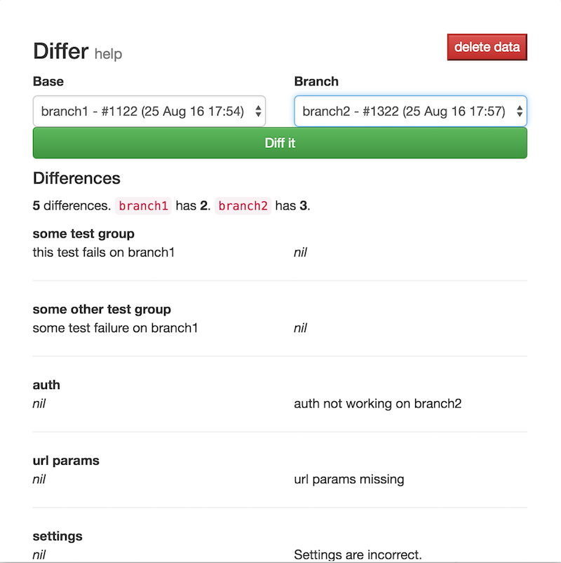

# teamcity-failure-diff
A chrome extension that gives the difference in failures between two teamcity build pages.

## Usage
1. Open the teamcity pages you want to compare. It will automatically collect the data upon opening.
1. Click the popup, and select the two branches you want to compare from the dropdowns.
    - If the branches aren't present, just reopen the popup after reloading the page
1. The script will match the tests and give the differences between both branches.
    - Failures that exist on both are not shown.

## Todo
1. Give users an option to choose their teamcity domain.
1. Improve the UI.

## Screenshot

